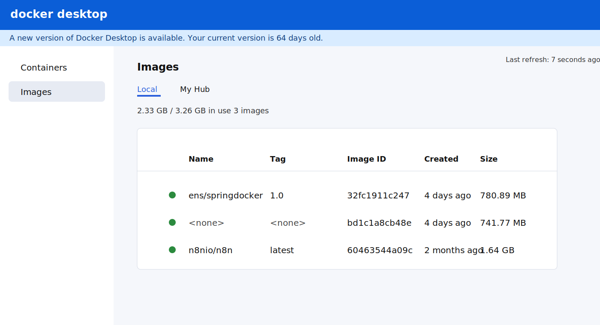
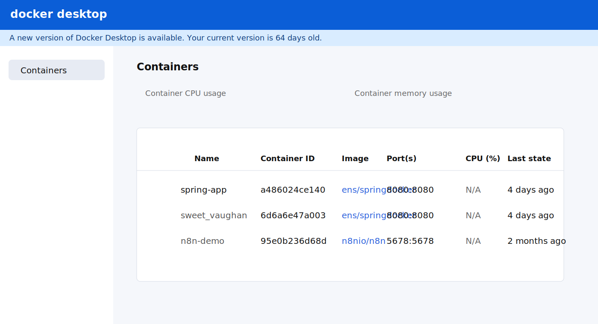

# TP-15 - Conteneurisation d'une application Spring Boot avec Docker

Ce projet presente une application Spring Boot simple preparee pour etre executee localement puis conteneurisee avec Docker. L'application utilise MySQL comme source de donnees et expose un endpoint HTTP sur le port `8080`.

## Stack technique

- Java 17
- Spring Boot
- Spring Web
- Spring Data JPA
- MySQL Connector/J
- Lombok
- Maven
- Docker
- Docker Compose

## Structure du projet

```text
tp15/
|-- src/
|   `-- main/
|       |-- java/ma/ens/springdocker/
|       `-- resources/application.properties
|-- docs/
|   `-- screenshots/
|-- Dockerfile
|-- docker-compose.yml
|-- mvnw
|-- mvnw.cmd
|-- pom.xml
`-- README.md
```

## Prerequis

- Java 17
- Maven ou le wrapper Maven fourni
- Docker Desktop
- Une base MySQL accessible

## Configuration applicative

Le fichier [application.properties](src/main/resources/application.properties) est configure avec les proprietes suivantes :

```properties
spring.datasource.url=jdbc:mysql://localhost:3306/demo_db?createDatabaseIfNotExist=true
spring.datasource.username=root
spring.datasource.password=1234
spring.jpa.hibernate.ddl-auto=update
server.port=8080
```

La base `demo_db` est creee automatiquement si elle n'existe pas encore. Dans la configuration locale du TP, l'utilisateur est `root` et le mot de passe est `1234`.

## Execution locale

1. Compiler le projet :

```bash
./mvnw clean package
```

2. Demarrer l'application :

```bash
./mvnw spring-boot:run
```

3. Ouvrir l'application :

```text
http://localhost:8080
```

## Construction de l'image Docker

1. Generer le jar :

```bash
./mvnw clean package -DskipTests
```

2. Construire l'image :

```bash
docker build -t ens/springdocker:1.0 .
```

3. Verifier les images :

```bash
docker images
```

## Execution avec Docker

Pour lancer uniquement l'application :

```bash
docker run -d -p 8080:8080 --name spring-app ens/springdocker:1.0
```

Pour suivre les logs :

```bash
docker logs -f spring-app
```

Pour arreter et supprimer le conteneur :

```bash
docker stop spring-app
docker rm spring-app
```

## Execution avec Docker Compose

Le projet fournit aussi un [docker-compose.yml](docker-compose.yml) qui demarre :

- un conteneur `mysql-db`
- un conteneur `spring-app`

Commandes utiles :

```bash
docker-compose up -d
docker ps
docker-compose logs -f
docker-compose down
```

## Notes utiles

- Si MySQL tourne sur la machine hote au lieu d'un conteneur Docker, `localhost` dans le conteneur ne pointera pas toujours vers l'hote.
- Avec Docker Desktop sur Windows ou macOS, `host.docker.internal` peut etre utilise si necessaire.
- Avec `docker-compose.yml`, le service Spring utilise directement le nom du service MySQL `mysql-db`.

## Preuves visuelles

### Image Docker creee

La capture suivante reprend la verification de l'image `ens/springdocker:1.0` dans Docker Desktop :



### Conteneur de l'application

La capture suivante reprend la presence du conteneur `spring-app` expose sur `8080:8080` :



## Resultat attendu

Apres build et execution, l'application doit etre accessible sur `http://localhost:8080`, et l'image `ens/springdocker:1.0` doit apparaitre dans Docker Desktop.
